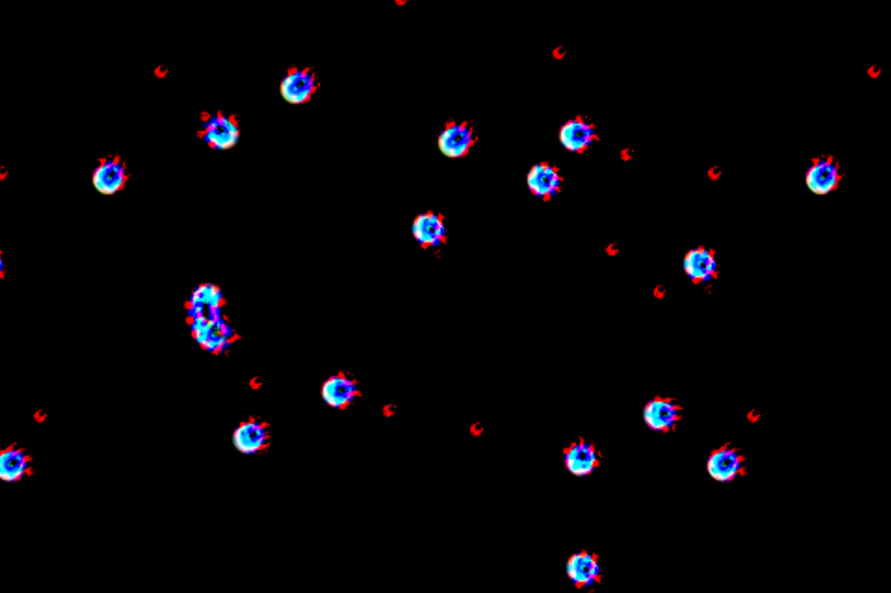
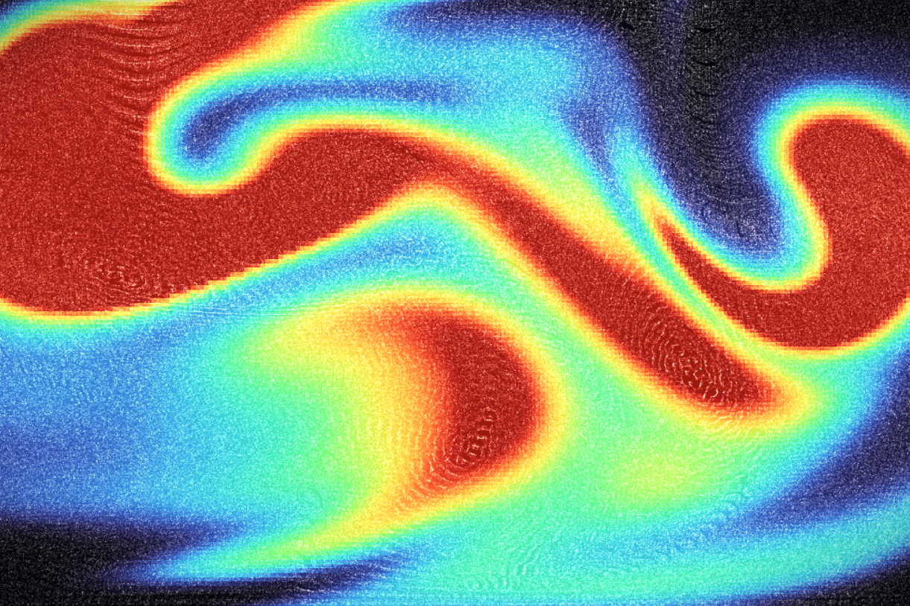
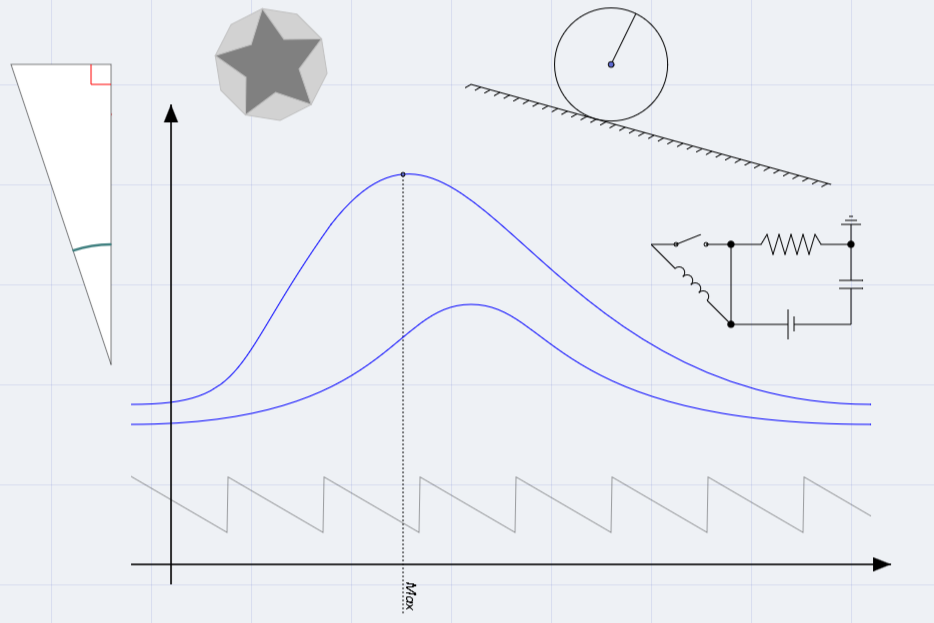
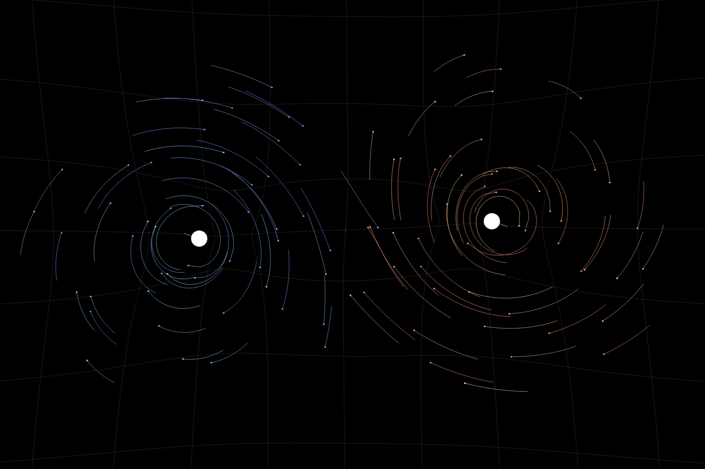
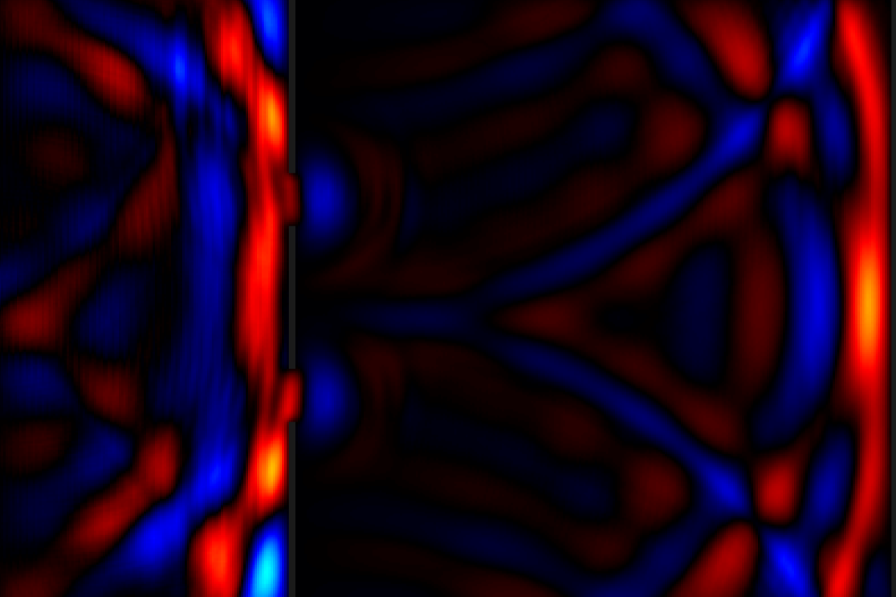

# Colin Bossu Réaubourg (Wartets)

**Scientific Software Developer | Computational Physicist**

 

  I am a final-year Physics student (B.Sc.) at Université Paris Cité with a strong specialization in computational physics, high-performance computing, and interactive simulations. 
  
  My work bridges the gap between theoretical mathematical models and real-time visualization engines. I specialize in developing high-throughput simulations using C++20, OpenGL Compute Shaders, and WebAssembly. My academic focus includes Quantum Mechanics, Fluid Dynamics, and Complex Systems.

 

## Technical Proficiency

| Core Engineering | HPC & Graphics | Web & Visualization | Scientific Stack |
| :---: | :---: | :---: | :---: |
|           |           |           |           |

 

## Selected Engineering Projects

<table border="0" width="100%">
  <tr>
    <td width="45%" align="center">
      
    </td>
    <td width="55%" valign="top">
      <h3>1. Lenia GPU Simulator</h3>
      

        
        
        
      

      

        A state-of-the-art implementation of Lenia, a continuous cellular automaton. This engine is built for extreme performance, utilizing a <b>"Zero-Copy" architecture</b> where the simulation state resides permanently in VRAM, achieving throughputs exceeding <b>10 Gcells/s</b> via Compute Shaders.
      

      <ul>
        <li><b>Features:</b> Massive library of 548 pre-loaded species, multichannel RGB dynamics, and 11 distinct growth functions.</li>
        <li><b>Metrics:</b> Includes real-time centroid tracking and stability monitoring.</li>
      </ul>
      <a href="https://wartets.github.io/Lenia/docs/"><b>View Documentation &rarr;</b></a>
    </td>
  </tr>
</table>

<table border="0" width="100%">
  <tr>
    <td width="55%" valign="top">
      <h3>2. Turbulence Simulation (CFD)</h3>
      

        
        
        
      

      

        A high-performance 2D fluid dynamics engine compiled to WebAssembly for browser-based execution. Utilizing the <b>Lattice Boltzmann Method (LBM)</b>, it supports <b>Large Eddy Simulation (LES)</b> via the Smagorinsky model to handle turbulence efficiently.
      

      <ul>
        <li><b>Physics:</b> Non-Newtonian fluid rheology, vorticity confinement, and buoyancy.</li>
        <li><b>Rendering:</b> Custom WebGL2 engine handling scalar field visualization in real-time.</li>
      </ul>
      <a href="https://github.com/wartets/Turbulence-sim"><b>View Repository &rarr;</b></a>
    </td>
    <td width="45%" align="center">
      
    </td>
  </tr>
</table>

<table border="0" width="100%">
  <tr>
    <td width="45%" align="center">
      
    </td>
    <td width="55%" valign="top">
      <h3>3. TikZ Generator</h3>
      

        
        
        
      

      

        A comprehensive visual editor designed to bridge the gap between visual drafting and LaTeX coding. The application provides an intuitive canvas for geometric shapes, electric circuits (Circuitikz), and logic gates, generating clean, semantic <b>TikZ code</b> in real-time.
      

      <ul>
        <li><b>Capabilities:</b> Freehand drawing with algorithmic smoothing and local state persistence.</li>
        <li><b>Utility:</b> Eliminates the overhead of writing complex vector graphics code from scratch.</li>
      </ul>
      <a href="https://wartets.github.io/TikZ-Generator/"><b>Launch Application &rarr;</b></a>
    </td>
  </tr>
</table>

<table border="0" width="100%">
  <tr>
    <td width="55%" valign="top">
      <h3>4. N-Body Simulation</h3>
      

        
        
        
      

      

        An advanced physics sandbox for simulating N-body systems. The engine implements the <b>Barnes-Hut algorithm</b> to reduce the computational complexity of long-range force calculations to $O(n \log n)$, enabling large-scale simulations.
      

      <ul>
        <li><b>Dynamics:</b> Features elastic bonds, solid barriers, thermodynamic properties, and environmental viscosity.</li>
        <li><b>Control:</b> Full real-time control over simulation parameters and integrator precision.</li>
      </ul>
      <a href="https://wartets.github.io/N-Body-Simulation/"><b>Launch Application &rarr;</b></a>
    </td>
    <td width="45%" align="center">
      
    </td>
  </tr>
</table>

<table border="0" width="100%">
  <tr>
    <td width="45%" align="center">
      
    </td>
    <td width="55%" valign="top">
      <h3>5. FDTD Wave Simulator</h3>
      

        
        
        
      

      

        A numerical simulator modeling 2D scalar wave propagation using the <b>Finite-Difference Time-Domain (FDTD)</b> method. The project employs a client-server architecture where a Python backend performs matrix calculations while a responsive frontend handles visualization.
      

      <ul>
        <li><b>Simulation:</b> Models interference, reflection, and diffraction.</li>
        <li><b>Boundaries:</b> Configurable conditions (Dirichlet, Neumann, Mur absorbing layers).</li>
      </ul>
      <a href="https://wartets.github.io/FDTD-Wave-Simulator/"><b>Launch Application &rarr;</b></a>
    </td>
  </tr>
</table>

 

## Academic Research & Publications

I maintain a digital archive of my academic notes, reports, and original research.

> **[Digital Document Library](https://wartets.github.io/Wartets/lib/library.html)**  
> An interactive archive featuring a custom lazy-loading PDF viewer and fuzzy search.

 

| Year | Title & Description | PDF |
| :--- | :--- | :---: |
| **2026** | **Real-Time Interactive Fluid Dynamics on the Web** Technical study on implementing the Lattice Boltzmann Method using WebAssembly and WebGL2. Detailed analysis of high-performance CFD engine implementation, LES turbulence, and non-Newtonian rheology. |  |
| **2026** | **Resolution of NP-Complete Problems via Monte Carlo** Application of the Metropolis-Hastings algorithm to Sudoku grid solving. Analysis of convergence rates and energy landscapes in combinatorial optimization problems. |  |
| **2025** | **Experimental Study of the Lasso** Experimental analysis of the supercritical bifurcation of a rotating ring. Study of finite geometry effects and mechanical imperfections (Laboratory Report). |  |